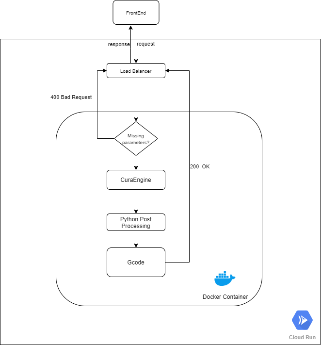

# CSCE689-FinalProject
# Interactive Infill Reinforcement - Backend

## Team members
Nelson Dsouza - Front-end development: Can be found @ [Github Link](https://github.tamu.edu/dso-nelson/CSCE689-Final-Team-Pumpkin)

Luochao Wang - Back-end development: Contents are in this repository.

### General information
The backend service uses the following dependencies:
  1. [CuraEngine](https://github.com/Ultimaker/CuraEngine): This is used to slice the stl file received from the frontend.
  2. [Flask](https://flask.palletsprojects.com/en/1.1.x/): This is used to start the backend service.
  3. Docker: This is required to set up CuraEngine for faster local development. If you prefer setting up CuraEngine locally without docker, refer to [CuraEngine](https://github.com/Ultimaker/CuraEngine)
  4. Credits to [GradientInfill(https://github.com/CNCKitchen/GradientInfill) project. This project adapts parts of the codes from them for Gcode postprocessing.
  5. For deployment, this project uses the [Cloud Run](https://cloud.google.com/run) service in Google Cloud Platfrom.

This backend service listens on the request from the frontend. Upon receiving a request which contains a stl file, along with printing settings and gradient settings, it will starts the CuraEngine with the printing setting to slice the stl file and produce the Gcode. When the slicing is done, it starts the postprocessing using the gradient setting and then sends back the processed gcode to the frontend.



The current service by default supports Creality Ender 3 printer. To support more printers, you should add new resource definitions and extrudesr to the `main` foler and the modify the `main\cura_service\gradient_infill\defaults.py` script. Refer to [resorces](https://github.com/Ultimaker/Cura/tree/master/resources) for currently available definitions and extruder.
## Get Started
### Local server development (require docker installed)
  1. Clone the repo `git clone https://github.com/wangluochao902/CSCE689-FinalProject.git`
  2. `cd CSCE689-FinalProjec`
  3. Build image `cura` using the dockerfile `docker build . -t cura`
  4. Start a container by `docker run -it cura -p 5000:5000`
  5. Now you backend is started at `http:127.0.0.1:5000`. You can change the url in frontend for communication, e.g. `http://127.0.0.1:5000/gradientInfill` 
  An example for talking to backend server from the frontend is shown below:
  ```
  // Read a local stl model and send it the the backend.
  // The backend server will process the stl file and return the processed Gcode.
  const axios = require("axios");
var fs = require("fs");
fs.readFile(
  "D:\\courses\\csce689\\final\\backend\\main\\SingleDisk.stl",
  "utf-8",
  (error, data) => {
    if (error) throw error;
    axios({
      method: "POST",
      // url: "http://127.0.0.1:5000/gradientInfill",
      url: "https://gradient-z6uig4pceq-uc.a.run.app/gradientInfill",
      headers: { "Content-Type": "application/json" },
      data: {
        gradient_setting: {
          max_flow: 550,
          min_flow: 100,
          enable_gradient: true,
          infill_targets: [
            [
              -9.125003333992183,
              15.624632510615706,
              1.0372603919879744,
              10,
              10,
            ],
            [11.973183042705697, 8.14289606298471, 3.794098643118691, 4, 20],
            [
              -13.128027255861639,
              -11.091992474719191,
              4.6762868834805085,
              3,
              5,
            ],
          ],
        },
        print_setting: {
          infill_sparse_density: 40,
          infill_pattern: "gyroid",
          disable_top_bottom_layers: true,
          adhesion_type: "Skirt",
          retraction_enable: true,
          retraction_amount: 6.5, // This is Retraction Distance
          speed_print: 50,
          speed_infill: 50,
          speed_wall: 25,
          material_print_temperature: 210,
          material_print_temperature_layer_0: 210, // this is Printing Temperature Initial Layer
          material_initial_print_temperature: 210, // this is Initial Printing Temperature
          material_final_print_temperature: 210, // this is material_final_print_temperature Final Printing Temperature
          material_bed_temperature: 60, // this is Build Plate Temperature
          material_bed_temperature_layer_0: 60, // this is Build Plate Temperature Initial Layer
          other_setting_string: "-s retraction_speed=25 -s speed_travel=150 -s initial_bottom_layers=1"
        },
        stl_file: data,
      },
    }).then((res) => {
      // console.log(res.data.gradient_gcode)
      fs.writeFile(
        "D:\\courses\\csce689\\final\\backend\\main\\js_gradient1.gcode",
        res.data.gradient_gcode,
        (error) => {
          if (error) throw error;
        }
      );
    }).catch(err => {
      if (err.response) {
        console.log(err.response.data)
      }
  });
  }
);
  ```
These are the important fields in the request:
  1. `stl_file`: UTF-8 String of the STL model.
  2. `print_setting`: These setting will be used to overwrite the default settings. You can overwrite more settting in the `other_setting_string` subfield. Refer to [fdmprinter.def.json](https://github.com/wangluochao902/CSCE689-FinalProject/blob/main/main/fdmprinter.def.json) for other available settings.Note the format in `other_string_setting`. You should add `-s` for each new setting.
  3. `gradient_setting`: This is used for Python post processing. 
     * max_flow: Percentage of original extrusion (the extrusion generated by Cura). Used as the maximum extrusion for the postprocessing.
     * min_flow: Percentage of original extrusiong (the extrusion generate by Cura). Used as minimum extrusion for the postprocessing.
     * enable_gradient: Whether to enable gradient of the inserted circle. If set to false, all the area of the inserted circle will use the max_flow (maximum extrusion); If true, the extrusion will increase from the perimeter(min_flow) to the center(max_flow) incrementally.
     * gradient_discretization: Only used when enable_gradient is true. This indicates how many resolution of the gradient, i.e. how many steps from the perimeter to the certer when increasing the extrusion.

### Deploy to the cloud (We use the Cloud Run service at Google Cloud Platform)
